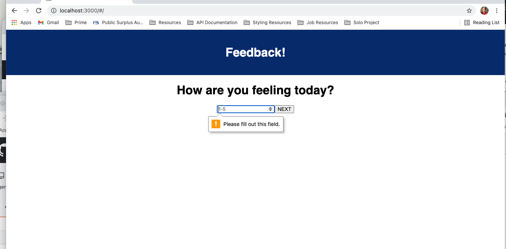
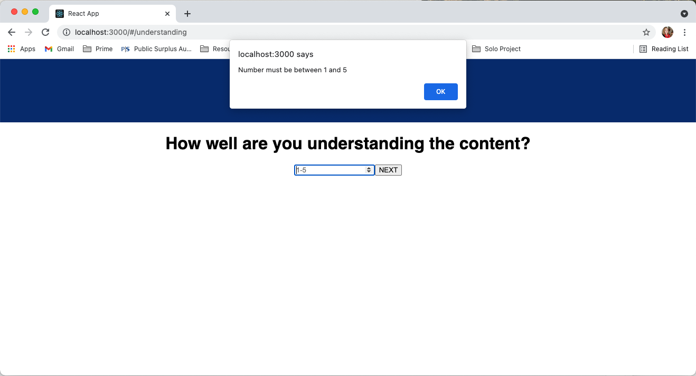
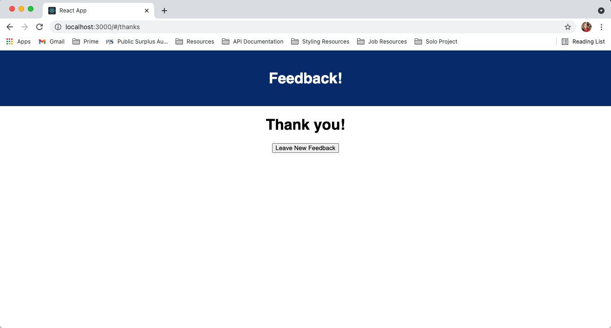

# Project Name

Feedback Form.

## Description

Duration: Weekend cram session.

This app provides a feedback form for users to submit their feedback on multiple questions. Research shows that having multiple pages for feedback results in higher completion rates of the form. The feedback will be stored in a database for future use.

## Prerequisites
Node.js
Express.js
postgresql

## Built With
Express https://expressjs.com/en/starter/installing.html
PG https://www.postgresql.org/download/
Node https://nodejs.org/en/download/
Axios https://axios-http.com/docs/intro

## Installation

1. Create a database named prime_feedback
2. The queries in the data.sql file are set up to create all the necessary tables and populate the needed data to allow the application to run correctly. The project is built on Postgres, so you will need to make sure to have that installed. We recommend using Postico to run those queries as that was used to create the queries.
3. Open up your editor of choice and run an npm install
4. Run npm run server in your terminal
5. Run npm run client in your terminal
6. The npm run client command will open up a new browser for you!

## Screenshots

